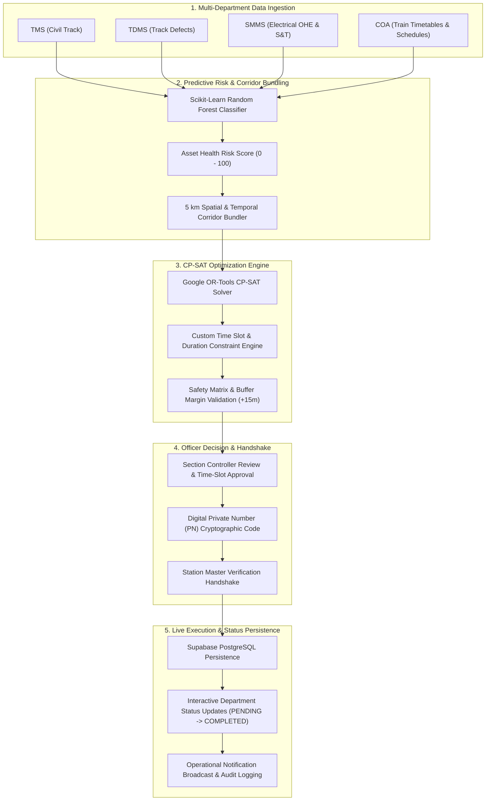

# RETRACK – RailSync-AI

### AI-Powered Railway Maintenance Planning, Operations Coordination & Decision Support Platform
**SIH 2026 Problem Statement ID:** 26027  
**Title:** AI-Powered Automatic Block Planning to Maximize Asset Availability for Train Operations on Indian Railways  
**Division:** Northern Railway (Delhi Division — NDLS / AGC / GZB Corridors)

---

## 📌 Executive Summary

**RETRACK – RailSync-AI** is an enterprise-grade decision support platform built for **Indian Railways**. It unifies multi-departmental maintenance requests from legacy systems (**TMS** for Civil Track, **TDMS** for Track Defects, and **SMMS** for Electrical Traction OHE & Signal/Telecom), cross-references live train schedules from **COA (Control Office Application)**, and leverages **Google OR-Tools CP-SAT Mixed-Integer Linear Programming (MILP)** alongside **Scikit-Learn Machine Learning** to automatically generate conflict-free maintenance block possessions.

By bundling geographically proximate maintenance tasks across departments within a **5 km spatial corridor**, RETRACK reduces corridor downtime by **up to 40%** while maintaining mandatory safety buffer margins (+15 mins) around passing express trains.

---

## 🏗 Architecture Pattern: Model-View-Controller (MVC)

RETRACK – RailSync-AI enforces a clean, modular **Model-View-Controller (MVC)** architectural pattern across both backend services and frontend user interfaces:

```
                      +---------------------------------+
                      |       USER / BROWSER CLIENT     |
                      +---------------------------------+
                                       |
                                       v
               +-----------------------------------------------+
               |                 VIEW LAYER                    |
               |  - React Pages (BlockPlanner, DigitalPn, etc) |
               |  - FastAPI API Routes (REST Controllers)      |
               +-----------------------------------------------+
                                 |            ^
                    HTTP Request |            | JSON Response
                                 v            |
               +-----------------------------------------------+
               |              CONTROLLER LAYER                 |
               |  - MaintenanceController (CRUD & State)       |
               |  - OptimizerController (CP-SAT Solver)        |
               |  - RiskController (Scikit-Learn ML Engine)    |
               |  - PNController (2-Factor Handshake)          |
               +-----------------------------------------------+
                                 |            ^
                   Business Data |            | Domain Model Data
                                 v            |
               +-----------------------------------------------+
               |                 MODEL LAYER                   |
               |  - Domain Entities (app/models/domain.py)     |
               |  - Pydantic DTO Schemas (app/schemas/)         |
               |  - Supabase PostgreSQL Database (schema.sql)  |
               +-----------------------------------------------+
```

### MVC Layer Responsibilities

1. **Model Layer (`backend/app/models/` & `backend/app/schemas/`)**:
   - Encapsulates domain entities (`MaintenanceRequestModel`, `TrainModel`, `BlockPossessionModel`, `DigitalPNModel`, `NotificationModel`).
   - Validates incoming and outgoing data structures using Pydantic DTOs.
   - Handles SQL persistence and live table synchronizations with Supabase PostgreSQL.

2. **Controller Layer (`backend/app/controllers/` & `backend/app/services/`)**:
   - Contains business logic, optimization math, and predictive risk scoring.
   - `MaintenanceController`: Manages maintenance request workflows and status persistence (`PENDING` -> `COMPLETED`).
   - `OptimizerController`: Orchestrates Google OR-Tools CP-SAT bundling and schedule constraint solving.
   - `RiskController`: Evaluates Scikit-Learn Random Forest failure probability and risk feature weights.
   - `PNController`: Manages cryptographic Private Number generation and 2-step Station Master verification.

3. **View Layer (`frontend/src/pages/` & `backend/app/api/routes/`)**:
   - **Backend API Views**: FastAPI route endpoints that receive requests, invoke Controller methods, and return serialized JSON views.
   - **Frontend UI Views**: Interactive React pages (Block Planner, Analytics Dashboard, Digital PN Exchange, Notification Center) with Light/Dark theme rendering.

---

## 🛠 Technology Stack

### Frontend Architecture
- **Framework:** React 18.2 with TypeScript 5.2 (100% Strict Type Safety)
- **Build System:** Vite 5.4 (Instant Hot Module Replacement & Production Bundling)
- **Styling:** TailwindCSS 3.4, PostCSS, Custom Light/Dark Theme Context
- **Icons & UI:** Lucide React Icon Library
- **Mapping Canvas:** Mapbox GL JS 3.3 (Vector Track Map & Interactive GIS Layers)
- **Data Visualization:** Recharts 2.12 (Pie Charts, Bar Charts, Risk Importance Gauges)
- **HTTP & Cloud SDK:** Axios 1.6 & `@supabase/supabase-js` v2.4

### Backend Architecture
- **Architecture Pattern:** MVC (Model-View-Controller) Architecture
- **Language & Runtime:** Python 3.11+ / 3.14
- **API Framework:** FastAPI 0.110+ (Asynchronous ASGI Engine with OpenAPI Docs)
- **Data Validation:** Pydantic v2.6 & `pydantic-settings`
- **Security:** PyJWT (HS256 Token Auth), Passlib Bcrypt, Role-Based Access Control (RBAC)
- **Web Server:** Uvicorn (Production ASGI Server)

### AI, Machine Learning & Mathematical Optimization
- **Optimization Solver:** Google OR-Tools v9.9 (CP-SAT Constraint Programming Solver)
- **Predictive Risk Model:** Scikit-Learn v1.4 (Random Forest Classifier & Feature Importance Evaluator)
- **Data Processing:** Pandas v2.2, NumPy v1.26, Joblib v1.3

### Database & Live Cloud Persistence
- **Engine:** Supabase PostgreSQL 15+ (Cloud Relational Database)
- **Driver:** `supabase-py` v2.4, Direct PostgreSQL Connection Pooler
- **Schema:** 17 Relational Tables, `uuid-ossp` Extensions, PL/pgSQL Triggers for `updated_at`, Spatial & Status B-Tree Indexes.

---

## 🔄 End-to-End System Workflow



---

## 🚀 Key Feature Modules

### 1. CP-SAT Block Optimizer & Custom Time Slot Selection ([BlockPlannerPage.tsx](file:///d:/SIH_PROJECT/frontend/src/pages/BlockPlannerPage.tsx))
- **Automated Mathematical Scheduling**: Generates conflict-free block possession windows based on section constraints.
- **Custom Time-Slot & Duration Control**: Section Controllers can input custom start/end times (`customStartTime`, `customEndTime`) or duration windows to evaluate instant schedule feasibility before approving.
- **Joint Department Possession**: Displays bundled Civil, Electrical, and S&T tasks sharing the same track possession window.

### 2. AI Predictive Risk Simulator & Calculator ([AnalyticsPage.tsx](file:///d:/SIH_PROJECT/frontend/src/pages/AnalyticsPage.tsx))
- **Interactive Asset Risk Calculator**: Evaluate failure probability (0.0 - 1.0) and Asset Health Risk Score (0 - 100) across target railway assets (`TRK-124`, `OHE-124`, `SIG-125`).
- **Random Forest Feature Importance Visualizer**: Displays ML decision weights for Defect Severity (35%), Structural Failures (25%), Defect Frequency (20%), Inspection Score (12%), and Asset Age (8%).
- **Department-Wise Maintenance Share**: Visual charts depicting task distribution across Civil, Electrical, and Signal & Telecom departments.

### 3. Digital Private Number (PN) Exchange Protocol ([DigitalPnPage.tsx](file:///d:/SIH_PROJECT/frontend/src/pages/DigitalPnPage.tsx))
- **Instant Automatic PN Generation**: Generates cryptographic PN codes (`PN-847291`) on click or load with single-click copy to clipboard.
- **2-Factor Handshake Verification**: Station Masters select their station code (`NDLS`, `AGC`, `GZB`, `TKD`, `NZM`) and complete authorization, activating `POSSESSION AUTHORIZED & LIVE ACTIVE` status.
- **Audit Log Table**: Full log history of past PN handshakes.

### 4. Operational Notification Center ([NotificationsPage.tsx](file:///d:/SIH_PROJECT/frontend/src/pages/NotificationsPage.tsx))
- **Filter Chips**: Filter system alerts by `All Alerts`, `Unread`, `Critical Risk`, `Warnings`, `Advisories`, and `Resolved`.
- **Broadcast Operational Alerts**: Issue custom alerts with title, severity level, department tag, category code, and description.
- **Quick Feed Actions**: Toggle read/unread, delete notification, mark all read, or clear feed.

### 5. Department Status Management ([MaintenanceRequestsPage.tsx](file:///d:/SIH_PROJECT/frontend/src/pages/MaintenanceRequestsPage.tsx))
- **Live Status Persistence**: Department officers can update task states (`PENDING`, `IN_PROGRESS`, `COMPLETED`, `REJECTED`) which write directly to Supabase PostgreSQL in real time.

---

## 📂 Repository Structure (MVC Organized)

```
SIH_PROJECT/
├── database/
│   ├── schema.sql              # Supabase PostgreSQL 15+ DDL (17 Relational Tables)
│   └── seed.sql                # Northern Railway NDLS-AGC corridor operational demo data
├── backend/
│   ├── app/
│   │   ├── api/routes/         # VIEW LAYER: FastAPI endpoints (JSON Views & Routes)
│   │   ├── controllers/        # CONTROLLER LAYER: Request Orchestrators (Maintenance, Optimizer, Risk, PN)
│   │   ├── core/               # Configuration settings, CORS, JWT security
│   │   ├── db/                 # Database Connection Manager & Supabase queries
│   │   ├── models/             # MODEL LAYER: Domain Data Entities (Maintenance, Train, PN, Notification)
│   │   ├── schemas/            # MODEL LAYER: Pydantic Request/Response DTO Schemas
│   │   ├── services/           # BUSINESS LAYER: OR-Tools solver & ML model engines
│   │   └── main.py             # FastAPI Application Entry Point
│   ├── ai/                     # Scikit-Learn ML Risk Model & Feature Engineering
│   ├── requirements.txt        # Python dependencies
│   └── .env                    # Backend environment variables
├── frontend/
│   ├── src/
│   │   ├── components/         # VIEW LAYER: Reusable UI Components (Header, Sidebar, Search, Widgets)
│   │   ├── context/            # STATE LAYER: AuthContext, ThemeContext, RealtimeContext
│   │   ├── lib/                # Supabase JS Client helper
│   │   ├── pages/              # VIEW LAYER: React Pages (Dashboard, BlockPlanner, DigitalPn, Analytics, Notifications)
│   │   ├── services/           # API CLIENT LAYER: Axios client & backend endpoints
│   │   └── App.tsx             # Main App Router & Layout
│   ├── package.json            # Frontend NPM dependencies
│   └── .env                    # Frontend environment variables
└── tests/                      # Pytest unit & integration test suite (32 tests)
```

---

## 🚀 Quickstart Instructions

### 1. Prerequisites
- **Python 3.11+** or **3.14**
- **Node.js 18+** & `npm`
- **Git**

### 2. Live Supabase Database Setup
1. Open your [Supabase Dashboard](https://supabase.com/dashboard).
2. Open **SQL Editor** -> Execute `database/schema.sql`.
3. Execute `database/seed.sql` to seed Northern Railway operational demo data.

### 3. Backend Setup & Execution

```powershell
# Navigate to backend directory
cd backend

# Create virtual environment
python -m venv venv

# Activate virtual environment (Windows PowerShell)
.\venv\Scripts\Activate.ps1

# Install backend dependencies
pip install -r requirements.txt

# Run FastAPI server
python -m uvicorn app.main:app --reload --port 8000
```
- **API Base URL:** `http://localhost:8000`
- **Interactive OpenAPI Docs:** `http://localhost:8000/docs`
- **Health Check Endpoint:** `http://localhost:8000/api/v1/health`

### 4. Frontend Setup & Execution

```powershell
# Open a new terminal and navigate to frontend directory
cd frontend

# Install frontend dependencies
npm install

# Start Vite dev server
npm run dev
```
- **Web Application:** `http://localhost:5173`

---

## 🔑 Demo Access Credentials

Log in at `http://localhost:5173/login` using any of these roles:

| Role | Email | Password | Allowed System Permissions |
| :--- | :--- | :--- | :--- |
| **Section Controller** | `controller@railsync.ir` | `controller123` | Block Approval, CP-SAT Time Slot Selection, PN Generation |
| **Station Master** | `stationmaster@railsync.ir` | `station123` | Digital PN Verification Handshake, Station Clearance |
| **Track Engineer** | `engineer.civil@railsync.ir` | `engineer123` | Maintenance Request Creation, AI Asset Risk Analysis |
| **System Admin** | `admin@railsync.ir` | `admin123` | Governance Panel, RBAC Management, Audit Logs |

---

## 🧪 Verification & Automated Testing

Run the automated Pytest suite from the project root:
```powershell
d:\SIH_PROJECT\backend\venv\Scripts\pytest.exe d:\SIH_PROJECT\tests
```
- **Test Result:** `32 passed` (100% pass rate).
- **TypeScript Verification:** `npx tsc --noEmit` passed with **0 errors**.
- **Production Build:** `npm run build` compiled in **8.57s**.
